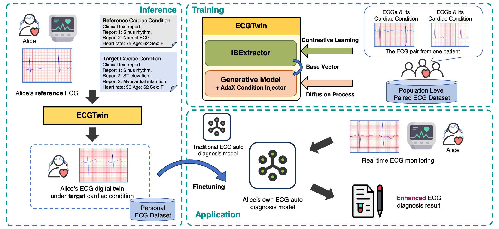

# ECGTwin: Personalized ECG Generation Using Controllable Diffusion Model



## 🚩 News

- [2025-08] Our paper has been released on [arXiv](https://arxiv.org/abs/2508.02720)!

## 🚀 Quick Generation

1. Build environment from `environment.yml`

2. Download pre-trained model weights from [here](https://huggingface.co/Laiyf/ECGTwin)

3. Move the downloaded `checkpoints` folder to directly under this repo's root:
```sh
mv /path/to/download/checkpoints ./checkpoints
```

4. Perform personalized ECG generation through: 
```sh
python ECGTwin_inference.py config/DiT_ECGTwin.yaml
```

Note that the reference ECG and cardiac condition are provided at `data/prepared_input`, which is stored via scripts in '## Reference Data Selection'. It is particularly encouraged to replace the reference ECG and cardiac condition with your own data.

## ⚙️ ECGTwin Training

1. Following the tutorial in `data/README_Data` or download processed training data from [huggingface repo](https://huggingface.co/datasets/Laiyf/ECGTwin_Data/tree/main). 

2. Move the training data into `data` folder

3. (Optional) Train Individual Base Extractor by:
```sh
python -m trainer.IBETrainer config/IBEConfig.yaml
```
Notice: A pre-trained IBExtractor is provided at 

4. Train Individual Base Extractor by:
```sh
python -m trainer.ECGTwinTrainer config/DiT_ECGTwin.yaml
```
You can change the type of config file to train different types of ECGTwin models and ablated models.

📝 Citation

If you find our work interesting and helpful, please consider giving our repo a star. Additionally, if you would like to cite our work, please use the following format:

```
@article{ECGTwin,
      title={ECGTwin: Personalized ECG Generation Using Controllable Diffusion Model}, 
      author={Yongfan Lai and Bo Liu and Xinyan Guan and Qinghao Zhao and Hongyan Li and Shenda Hong},
      journal={preprint at arXiv},
      year={2025}
}
```